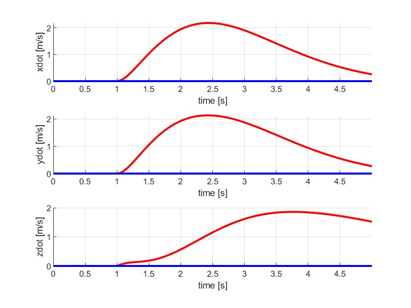
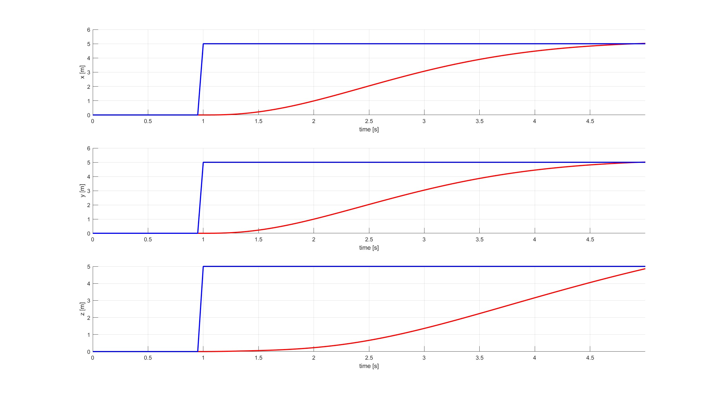

# Quadrotor Trajectory Control with PD Controller in MATLAB

## Overview

This repository contains a MATLAB implementation of quadrotor trajectory control using a **cascaded PD controller**. The control strategy includes:
- An **outer position control loop** to manage the quadrotor's spatial position.
- An **inner PD control loop** for attitude stabilization and precise orientation adjustments.

The cascaded control approach ensures that the quadrotor can achieve stable flight dynamics while following a desired trajectory.

## Project Features

- **Cascaded Controllers**: The outer PD controller handles position control, while the inner PD controller manages attitude and orientation.
- **Trajectory Following**: The control system is capable of following complex trajectories in 3D space.
- **Data Visualization**: Simulation results include trajectory graphs and response plots to visualize quadrotor performance.

## Getting Started

### Prerequisites

- MATLAB R2023a or later
- Control System Toolbox (for analyzing control performance)

### Installation

1. Clone the repository:
   ```bash
   git clone https://github.com/yourusername/quadrotor-trajectory-control.git
   ```
2. Open MATLAB and navigate to the repository folder.

### Usage

1. Run the main script:
   ```matlab
   runsim.m
   ```
2. The simulation will start, and you can observe the quadrotor’s behavior following the specified trajectory. Adjust parameters in `pid_controller.m` to modify control gains for different behaviors.

## Project Structure

- `runsim.m`: The main script to initialize parameters, configure the control system, and simulate the quadrotor trajectory.
- `quadEOM_readonly.m`: Defines the quadrotor dynamics.
- `pid_controller.m`: Configures the PD and PD controller parameters.
- `traj`: Directory has trajectories to be followed. 
- `crazyflie.m`: Defines quadrotors parameters.

## Results

### 1. Trajectory Following Plot

This graph shows the quadrotor following the desired path. The blue line represents the target trajectory, while the red line shows the quadrotor's actual path.


### 2. Position and Velocity Response

- **Position Control**: A graph showing the x, y, and z position responses over time.
- **Attitude Control**: A graph showing the linear velocity responses over time.




### 3. Video Demonstration

Watch a video of the quadrotor following a complex 3D trajectory:


## How It Works

The quadrotor trajectory control is implemented using a cascaded control structure:

1. **Outer Loop (PD Position Control)**: Computes the desired attitude based on the error between the current and desired positions.
2. **Inner Loop (PD Attitude Control)**: Stabilizes the quadrotor's orientation by adjusting thrust and moment outputs to achieve the desired attitude.

The combination of position control and attitude control enables the quadrotor to follow the desired trajectory accurately while compensating for disturbances.

## Future Enhancements

- Implement more complex trajectories and obstacle avoidance.
- Experiment with adaptive control to handle varying environmental conditions.
- Integrate real-time 3D visualization.

## Contributing

Contributions are welcome! If you have ideas for improvement, please open an issue or submit a pull request.

